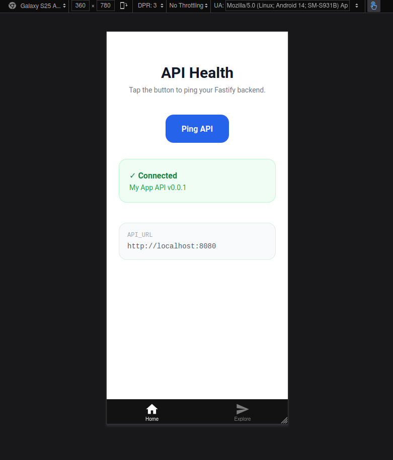
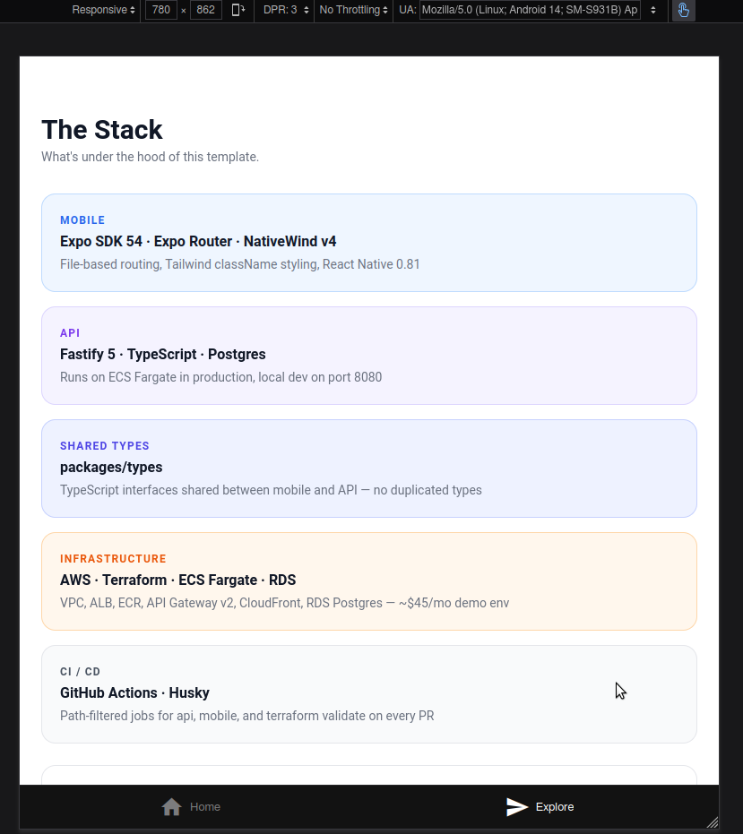

# expo-fastify-aws-starter

**Expo · React Native · NativeWind · Fastify · ECS Fargate · RDS · Terraform**

TODO: wire-up deployment actions

[](https://github.com/WillSams/expo-fastify-aws-starter/actions/workflows/pr-validate.yml)

A monorepo template for shipping a React Native mobile app backed by a Fastify API on AWS. Fork it, rename things, and ship.

| Layer | Tech |
|---|---|
| Mobile | Expo SDK 54, React Native, Expo Router (file-based routing), NativeWind v4 |
| API | Fastify 5, TypeScript, Postgres (via `DATABASE_URL`) |
| Shared types | `packages/types` — imported by both apps |
| Infrastructure | Terraform — ECS Fargate, RDS (Postgres), ALB, API Gateway v2, S3, CloudFront |
| Quality | ESLint, Prettier, Husky pre-commit + pre-push, GitHub Actions CI |




## When to use this stack

This template fits when:

- You want **TypeScript end-to-end** with types shared between mobile and API
- Your API needs **persistent storage** (Postgres) rather than a purely stateless function
- You want **predictable infrastructure costs** — one ECS task runs 24/7 vs. Lambda cold starts under load
- You need a foundation that scales from a single Fargate task to multiple replicas without rearchitecting

If your traffic is very low or bursty and you don't need Postgres, a Lambda-based template will be cheaper. For everything else — mobile apps with real data — this stack gets you to production without surprises.

## Prerequisites

- [Node.js 22](https://nodejs.org/) — `nvm use` picks the version in `.nvmrc`
- [nvm](https://github.com/nvm-sh/nvm) *(recommended)*
- [direnv](https://direnv.net/) *(recommended)*
- [Expo Go](https://expo.dev/go) on your phone — for quick previews without a native build
- [Docker](https://www.docker.com/) — for building the API image
- [Terraform CLI](https://developer.hashicorp.com/terraform/install)
- [AWS CLI](https://aws.amazon.com/cli/)

For mobile development you also need one of:

- **iOS**: Xcode (Mac only)
- **Android**: Android Studio + an emulator, or a physical device
- **Expo Go**: the fastest way to preview on a real device without a native build

## Getting Started

```bash
# 1. Use the right Node version
nvm use

# 2. Set up environment variables
cp .envrc.example .envrc   # fill in values
direnv allow

# 3. Install dependencies
npm install                           # root (husky, prettier, concurrently)
cd apps/api      && npm install && cd ../..
cd apps/mobile   && npm install && cd ../..
cd packages/types && npm install && cd ../..

# 4. Start everything together
npm run start
# or separately:
npm run dev:api      # Fastify API on :8080
npm run dev:mobile   # Expo (new terminal)
```

Open **Expo Go** on your phone, tap the QR scanner inside the app, and scan. The `--tunnel` flag routes through Expo's servers so it works regardless of your local network or firewall — no need to be on the same subnet as your dev machine. Or press `a` for Android emulator / `i` for iOS simulator.

The API runs at `http://localhost:8080`.

## Project Structure

```text
expo-fastify-aws-starter/
├── apps/
│   ├── api/               # Fastify API (deploys to ECS Fargate)
│   │   ├── src/
│   │   │   ├── app.ts     # Fastify instance, CORS, routes
│   │   │   ├── server.ts  # Entry point — starts the HTTP server
│   │   │   └── index.ts   # Re-exports app (used by tests)
│   │   ├── specs/         # Jest integration tests
│   │   └── Dockerfile
│   └── mobile/            # Expo React Native app (SDK 54)
│       ├── app/           # Expo Router file-based routes
│       │   ├── (tabs)/    # Tab navigator
│       │   │   ├── _layout.tsx
│       │   │   ├── index.tsx
│       │   │   └── explore.tsx
│       │   ├── _layout.tsx  # Root layout, imports global.css
│       │   └── modal.tsx
│       ├── components/    # Shared UI components
│       ├── hooks/         # useColorScheme, useThemeColor
│       ├── constants/     # Theme colours
│       ├── global.css     # Tailwind/NativeWind entry point
│       ├── tailwind.config.js
│       ├── metro.config.js
│       ├── babel.config.js
│       └── app.json
├── packages/
│   └── types/             # Shared TypeScript types
│       └── src/index.ts   # ApiResponse<T> and other shared interfaces
├── infra/                 # Terraform
│   ├── vpc.tf             # VPC, subnets, security groups
│   ├── ecr.tf             # ECR repository for API image
│   ├── ecs.tf             # ECS cluster, task definition, service
│   ├── alb.tf             # Application Load Balancer
│   ├── rds.tf             # RDS Postgres (db.t3.micro)
│   ├── api_gateway.tf     # HTTP API → VPC Link → ALB
│   ├── frontend.tf        # S3 + CloudFront (web companion / landing page)
│   └── environments/      # demo / staging / prod tfvars
└── .github/
    └── workflows/
        └── pr-validate.yml  # CI: lint + test + terraform validate
```

## Scripts

From the project root:

| Command | Description |
|---|---|
| `npm run dev:api` | Start the Fastify API in watch mode |
| `npm run test:api` | Run API tests |
| `npm run test:api:coverage` | API tests with coverage report |
| `npm run lint:api` | Lint the API |
| `npm run format:api` | Format the API |
| `npm run test:mobile` | Run mobile tests |
| `npm run test:mobile:coverage` | Mobile tests with coverage report |
| `npm run lint:mobile` | Lint the mobile app |
| `npm run format:mobile` | Format the mobile app |
| `npm run clean` | Remove all build artefacts and node_modules |

## Shared Types

Both apps import from `packages/types`:

```ts
// apps/api/src/app.ts
import type { ApiResponse } from '@template/types';

// apps/mobile/app/index.tsx
import type { ApiResponse } from '@template/types';
```

Add your domain types to `packages/types/src/index.ts` and they'll be available everywhere.

## Infrastructure

The Terraform configuration in `infra/` provisions:

- **VPC** with two public subnets across AZs, an internet gateway, and security groups
- **ECR** repository for the API Docker image (keeps last 10 images)
- **ECS Fargate** cluster, task definition, and service (0.25 vCPU / 512 MB by default)
- **ALB** routing HTTP traffic to ECS tasks
- **RDS Postgres** `db.t3.micro` in the same VPC, accessible only from ECS
- **API Gateway HTTP API** (v2) via VPC Link → ALB
- **S3 + CloudFront** for a web companion or landing page
- **CloudWatch** log groups for ECS and API Gateway

### Estimated cost (us-east-1, single demo environment)

| Resource | ~$/month |
|---|---|
| ECS Fargate (0.25 vCPU / 512 MB, 24/7) | ~$10 |
| ALB | ~$18 |
| RDS db.t3.micro | ~$15 |
| API Gateway (low volume) | <$1 |
| CloudFront + S3 | <$1 |
| **Total** | **~$45** |

Scale `api_desired_count`, `api_cpu`, and `api_memory` in the tfvars to fit your load.

### Deploy infrastructure

```bash
cd infra

# First time only
terraform init

# Preview changes
terraform plan -var-file=environments/demo.tfvars

# Apply
terraform apply -var-file=environments/demo.tfvars
```

### Deploy the API

Build and push the Docker image to ECR, then ECS will pick up the new image on the next deployment:

```bash
# Get the ECR URL from Terraform output
ECR_URL=$(terraform -chdir=infra output -raw ecr_repository_url)
AWS_ACCOUNT=$(aws sts get-caller-identity --query Account --output text)
AWS_REGION=us-east-1

# Authenticate Docker to ECR
aws ecr get-login-password --region $AWS_REGION \
  | docker login --username AWS --password-stdin $ECR_URL

# Build, tag, push
docker build -t api apps/api
docker tag api:latest $ECR_URL:latest
docker push $ECR_URL:latest

# Force ECS to pull the new image
aws ecs update-service \
  --cluster demo-template \
  --service demo-template-api \
  --force-new-deployment \
  --region $AWS_REGION
```

### Deploy the web frontend (optional)

If you're using the S3/CloudFront stack for a landing page:

```bash
S3_BUCKET=$(terraform -chdir=infra output -raw s3_bucket)
# build your web app, then:
aws s3 sync dist/ s3://$S3_BUCKET --delete
```

## Code Quality

- **Pre-commit** (Husky): formats and lints both apps + runs `terraform fmt`
- **Pre-push** (Husky): runs the full test suite for both apps
- **CI** (GitHub Actions): lint, test, and `terraform validate` run on every PR to `main`
- Branch names must follow semantic conventions: `feat/`, `fix/`, `chore/`, `refactor/`, `docs/`, `style/`, `test/`

## Publishing the mobile app

See [PUBLISH.md](PUBLISH.md) for step-by-step instructions on publishing to the Google Play Store.
